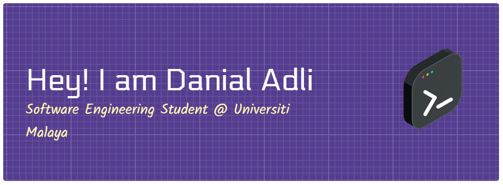

### Hi there 👋

I'm Ahmad Danial Adli, currently a Software Engineering student at Universiti Malaya.

- 🔭 I’m currently working on: Ways to be a qualified software developer as well as improving my coding skills from time to time.

- 📫 How to reach me: Feel free to connect with me here on GitHub or email me at [danialladli08@gmail.com].

__________________________________________________________________________________________

**📋 Languages**

   

**💻 IDEs/Editors**

 

